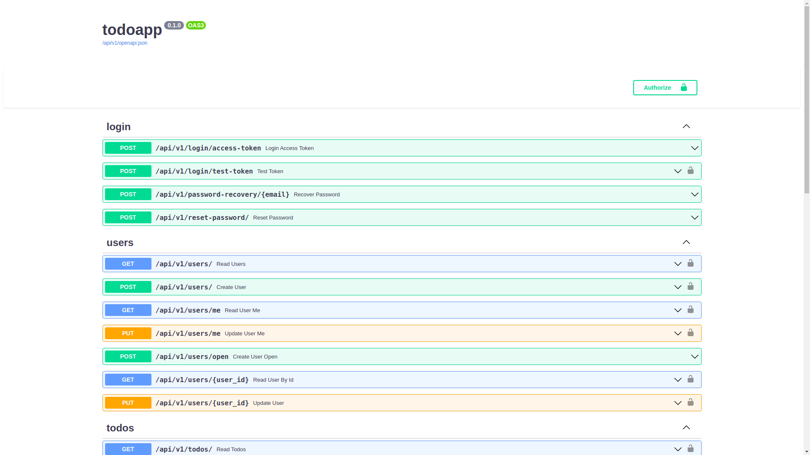
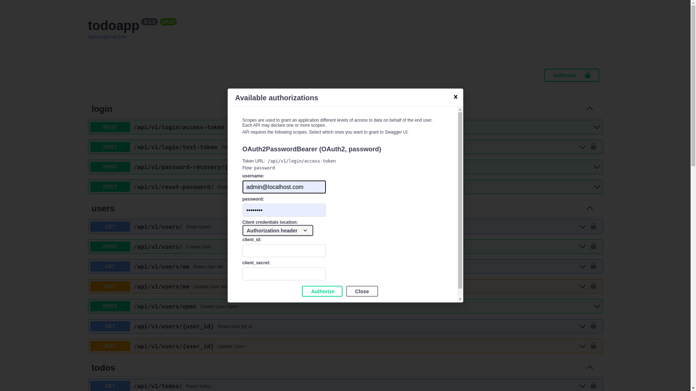

# TODO Application using FASTAPI
This project aims to implement a simple TODO app using FAST API.

## Pre-requisites

Following things must be installed on your system

- Python 3.8+
- docker engine
- docker-compose
- virtual env

## Set up

Clone the repository to your desired location.

It is recommended to use a virtual environment for coding and debugging purposes. To create one, use the following command:

```bash
python3.9 -m virtualenv myenv
```
> Make sure virtual env is outside the project repository.

and activate it using:

```bash
source myenv/bin/activate
```

After that, just run the following command to build and start the application:

```bash
docker-compose up --build
```

## Base Information

Base information is provided in the `.env` file. This project is currently
intended for running in localhost only.

## Documentation

Fast API provides auto generated schema and can be accessed at `localhost/docs` once your project is up and running. 





To run calls from within swagger, press the **Authorize** button. A modal will appear. 



Enter your username and password and press Authorize. It will log you in. Now you can call from the swagger directly.

## Testing

To run unit test cases for backend, simply run the following command in bash:

```bash
docker-compose run backend sh tests-start.sh
```

## References

This concept project has been designed using the [Fast API Project Generation](https://fastapi.tiangolo.com/project-generation/).

Using the [following repo](https://github.com/tiangolo/full-stack-fastapi-postgresql) mentioned in the above link.